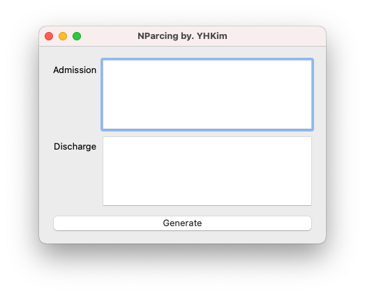
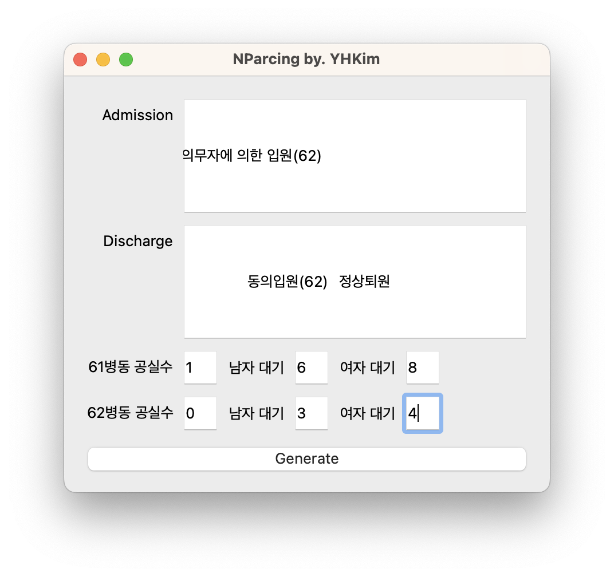

# Parcing admission/discharge data
이제 입퇴원 엑셀표를 보고 열심히 표 만드는 인생은 그만! GUI로 모든 것을 해결해요★

## How to use

구글 drive에 올려놓은 `Nparcing.exe` 파일을 실행합니다.

이후에 입원/퇴원 기록지를 EMR에서 엑셀로 뽑은 뒤 전체 선택 혹은 필요한 영역을 선택하여 복사 + 붙어넣기를 합니다.
또한 병동별 공실수, 남녀 입원대기자수를 입력합니다.

이후 generate을 누르면, `dangjik.xlsx` 파일이 `Nparcing.exe` 파일이 있는 폴더 내에 만들어집니다! (끝!)
혹시 오류사항이 있다면 `김영훈`에게 알려주세요! ㅎㅎ

***May the 내공 be with you..***

*Special thanks to: 함께 버그 잡아주고 기능 추가를 도와준 지홍이 형*
